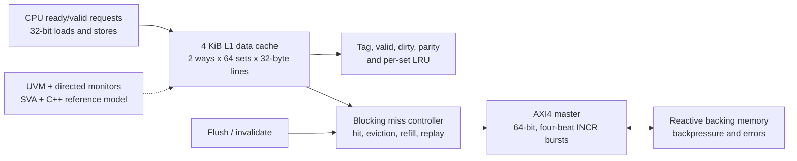

# AXI4 L1 Data Cache DV Project

A standalone RTL and design-verification project for a blocking, 4 KiB, 2-way set-associative L1 data cache. The cache uses a 32-bit CPU request interface and a 64-bit AXI4 master interface with four-beat line refill and writeback bursts.

This repository is independent of the earlier chiplet project. It reuses workflow ideas, but contains new cache RTL, tests, assertions, reference modeling, and reports.

## Verification Snapshot

| Evidence | Current result |
| --- | ---: |
| Directed/random Verilator scenarios | `17 / 17` passing |
| Functional coverage points | `18 / 18` observed |
| Compile-time bug mutations | `4 / 4` detected |
| Optional seeded stress executions | `100 / 100` passing |
| Raw design line coverage | `86.84%` |
| Reviewed design line coverage | `100.00%` |
| Design branch coverage | `98.21%` |
| Raw design toggle coverage | `50.57%` |
| Independent C++ model self-test | `PASS` |
| Full UVM environment | Compile/elaboration `PASS`; runtime under validation |
| Solver-backed formal | Harness ready; not run locally |

The executable suite covers cold refill, warm hits, clean and dirty replacement, independent AXI channel waits, read/write error propagation, byte strobes, maintenance, reset recovery, and seeded-random data checking. Generated metrics are in [docs/project_metrics.md](docs/project_metrics.md).

Generated metrics are in [docs/project_metrics.md](docs/project_metrics.md). Claims are intentionally separated from release targets that have not yet closed.

## Architecture




## Cache Policy

| Property | Configuration |
| --- | --- |
| Capacity | 4 KiB |
| Associativity | 2-way |
| Line size | 32 bytes |
| Sets | 64 |
| CPU data width | 32 bits |
| AXI data width | 64 bits |
| Write policy | Write-back, write-allocate |
| Replacement | One LRU victim bit per set |
| Outstanding misses | One |
| Integrity | Per-word parity |

The AXI interface is deliberately constrained to one outstanding transaction, fixed ID semantics, and four-beat `INCR` bursts. This is not an AXI compliance claim.

## Quick Start

```bash
make smoke          # fast cold-miss/hit/store path
make project-check  # lint, C++ model, regression, coverage/report generation
make bug-validate   # expected-failure mutation checks
make uvm-compile    # compile full UVM collateral with the external UVM-capable tool
make uvm-smoke      # bounded runtime probe; not currently a closure claim
make formal         # runs when SymbiYosys is installed
```

The default local flow uses the system Verilator. The optional UVM lane currently compiles with a sibling Verilator `5.043` development build and `uvm-verilator`; override these with `VERILATOR_UVM` and `UVM_HOME`.

## Reviewer Path

For a focused design-verification review:

1. Start with [project metrics](docs/project_metrics.md) for report-backed results.
2. Use the [verification traceability matrix](docs/traceability.md) to map requirements to stimulus, checkers, assertions, and coverage.
3. Read the [cache architecture](docs/architecture.md) for hit, eviction, refill, writeback, and maintenance behavior.
4. Review the [bug diary](docs/bug_diary.md) for four implemented mutation/debug cases.
5. Inspect [functional and code coverage](docs/coverage.md) and [performance characterization](docs/performance.md).
6. Check [UVM status](docs/uvm_status.md) and [formal status](docs/formal.md) for explicit tool and execution boundaries.

## Verification Structure

- Directed and seeded-random SystemVerilog bench for fast executable closure.
- UVM CPU agent, reactive AXI memory component, monitor, scoreboard, and constrained sequence.
- C++ reference model with a DPI-compatible C API and independent unit tests.
- Named assertions for response accounting and ready/valid stability.
- Formal harness for response-count, mutual-exclusion, and refill/eviction reachability properties.
- Generated regression, functional-coverage, mutation, performance, and metrics artifacts.

The [verification plan](docs/verification_plan.md) defines the intended closure model. The [bug diary](docs/bug_diary.md) records only implemented mutations, and [UVM status](docs/uvm_status.md) separates compilation evidence from incomplete runtime validation.

## Scope Boundaries

The design intentionally excludes coherence, atomics, MSHRs, non-blocking misses, speculative requests, and production ECC. The AXI4 interface is a constrained cache-master subset, not an AXI compliance implementation. Open-source simulation, coverage, and formal collateral are verification evidence, not commercial protocol, timing, CDC, or silicon signoff.
