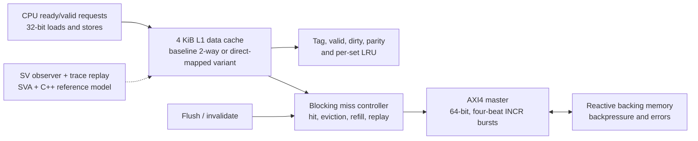
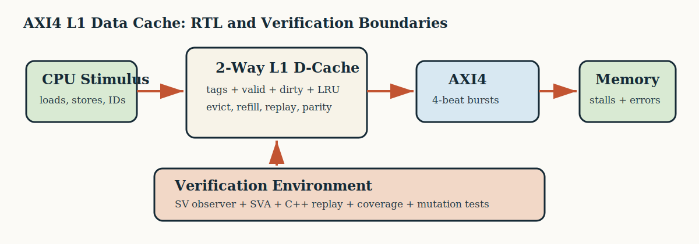

# AXI4 L1 Data Cache DV Project

A standalone RTL and design-verification project focused on cache microarchitecture, independent C++ prediction, replacement/error containment, and architecture tradeoffs. The blocking 4 KiB baseline is 2-way set-associative; equal-capacity direct-mapped and optional SECDED variants provide measured associativity and RAS evidence.

This repository is independent of the earlier chiplet project. It reuses workflow ideas, but contains new cache RTL, tests, assertions, reference modeling, and reports.

## Verification Snapshot

| Evidence | Current result |
| --- | ---: |
| Directed/random Verilator scenarios | `22 / 22` passing |
| Functional coverage points | `21 / 21` observed |
| Compile-time bug mutations | `4 / 4` detected |
| Manifest-driven stress executions | `100 / 100` passing |
| C++ trace-replay checks | `127 / 127` directed, performance, cross, and stress traces passing |
| Cache interaction cross coverage | `55 / 55` bins observed |
| Named protocol/architecture assertions | `18` |
| Waveform-backed debug cases | `1 / 1` reproduced |
| Raw design line coverage | `88.10%` |
| Reviewed design line coverage | `100.00%` |
| Design branch coverage | `95.00%` |
| Raw design toggle coverage | `59.49%` |
| Optional coverage-edge scenarios | `19 / 19` passing |
| Independent C++ model self-test | `PASS` |
| Equal-capacity associativity checks | `20 / 20` passing |
| Associativity study points | `14` model-checked points |
| Solver-backed formal tasks | `5 / 5` meeting expectation |
| Yosys geometry proxy | `2 / 2` equal-capacity storage/control proxies synthesized |
| Optional SECDED RAS matrix | `1 / 1` passing; `7 / 7` required RAS points |

The executable suite covers cold refill, warm hits, clean and dirty replacement, independent AXI channel waits, read/write error propagation, byte strobes, maintenance, reset recovery, and seeded-random data checking. Generated metrics are in [docs/project_metrics.md](docs/project_metrics.md). Claims remain separate from targets that have not closed.

## Architecture





## Cache Policy

| Property | Configuration |
| --- | --- |
| Capacity | 4 KiB |
| Baseline associativity | 2-way |
| Line size | 32 bytes |
| Baseline sets | 64 |
| CPU data width | 32 bits |
| AXI data width | 64 bits |
| Write policy | Write-back, write-allocate |
| Replacement | One LRU victim bit per set |
| Outstanding misses | One |
| Integrity | Per-word parity |

The comparison variant uses `128 sets x 1 way`; the baseline uses `64 sets x 2 ways`. Both retain 4 KiB capacity and 32-byte lines, so the study isolates associativity and set-count effects.

The AXI interface is deliberately constrained to one outstanding transaction, fixed ID semantics, and four-beat `INCR` bursts. This is not an AXI compliance claim.

## Quick Start

```bash
make smoke          # fast cold-miss/hit/store path
make project-check  # lint, C++ model, regression, coverage/report generation
make release-check  # stress, trace replay, crosses, performance, mutations, code coverage
make model-trace-check
make ras-check       # optional SECDED correction/containment matrix
make cache-cross-coverage
make coverage-edges # optional byte-strobe, reset/error, LRU, maintenance, and direct-mapped coverage evidence
make performance-sweep
make associativity-check
make associativity-characterize
make synth-characterize # Yosys associativity-cost proxy when Yosys is installed
make bug-validate   # expected-failure mutation checks
make debug-waveform # FST plus deterministic assertion-debug SVG
make formal-prove   # bounded safety, reachability, and mutation checks
make formal-small-prove # reduced-geometry bounded proof/cover lane when sby is installed
make uvm-runtime-smoke # compile + honest runtime SKIP/TIMEOUT reporting
```

The default flow uses the system Verilator and the C++ trace checker. Optional UVM source remains secondary methodology collateral; compilation requires external `VERILATOR_UVM` and `UVM_HOME`. If UVM phase runtime times out, `uvm-runtime-smoke` reports `SKIP` rather than counting equivalent non-UVM scenarios as UVM passes.

## Reviewer Path

For a focused design-verification review:

1. Start with [project metrics](docs/project_metrics.md) for report-backed results.
2. Use the [verification traceability matrix](docs/traceability.md) to map requirements to stimulus, checkers, assertions, and coverage.
3. Read the [cache architecture](docs/architecture.md) for hit, eviction, refill, writeback, and maintenance behavior.
4. Review the [bug diary](docs/bug_diary.md) for four implemented mutation/debug cases.
5. Follow the [hiring-manager case study](docs/hiring_manager_case_study.md) and [early-WLAST waveform case study](docs/debug_case_study.md) for assertion-driven failure triage.
6. Inspect [functional and code coverage](docs/coverage.md), [true cross coverage](docs/cross_coverage.md), and [per-request performance characterization](docs/performance.md).
7. Review the [AXI4 subset compliance appendix](docs/axi_subset_compliance.md), [equal-capacity associativity study](docs/associativity_characterization.md), and [synthesis characterization](docs/synthesis_characterization.md).
8. Check [SECDED/RAS evidence](docs/ras.md), [coverage closure case study](docs/coverage_closure_case_study.md), and [formal evidence](docs/formal.md). The [UVM status](docs/uvm_status.md) is retained only as secondary methodology collateral.

## Verification Bar

| Evidence | Implementation |
| --- | --- |
| Directed access matrix | Named read hit/miss, write hit/miss, clean/dirty eviction, and reset-recovery tests |
| AXI and memory checking | Reactive four-beat AXI model plus independent C++ trace replay and final-memory comparison |
| Assertions | Named CPU, AXI, replacement, maintenance, error-containment, and reset properties |
| Random and coverage | 100 reproducible manifest scenarios, feature coverage, and same-window interaction crosses |
| Coverage edges | Optional byte-strobe, reset beat matrix, AXI error matrix, LRU/replacement, maintenance-boundary, and direct-mapped structural coverage lane |
| Debug and automation | Four mutation detections, FST/SVG case study, GitHub Actions, and `make release-check` |
| Architecture tradeoff | 20 directed full-RTL geometry checks, 14 model-checked characterization points, and a Yosys associativity-cost proxy |
| Reliability variant | Optional data SECDED with correction, read scrub, double-error containment, C++ known-answer checks, assertions, and a 7-point RAS matrix |
| Formal | Depth-stated safety/error checks, reachable covers, and expected mutation failures |
| AXI subset | Cache-master subset contract mapped to assertions, tests, and reports |

## Verification Structure

- Directed and manifest-driven SystemVerilog stimulus with every random knob applied through plusargs.
- Bound event observer and independent C++ trace replay for responses, replacement, AXI bursts, errors, resets, maintenance, and backing memory.
- Named protocol and architecture assertions for fault containment, ordering, replacement, and maintenance exclusion.
- Non-gating UVM CPU agent, memory component, monitor, scoreboard, and sequence source retained as optional collateral.
- SymbiYosys bounded safety/error checks with hit, miss, dirty-eviction, and maintenance witness traces.
- Generated regression, functional-coverage, mutation, performance, and metrics artifacts.

The [verification plan](docs/verification_plan.md) defines the intended closure model. The [bug diary](docs/bug_diary.md) records only implemented mutations, and [UVM status](docs/uvm_status.md) separates compilation evidence from incomplete runtime validation.

## Scope Boundaries

The design intentionally excludes coherence, atomics, MSHRs, non-blocking misses, speculative requests, and production ECC. The AXI4 interface is a constrained cache-master subset, not an AXI compliance implementation. Open-source simulation, coverage, and formal collateral are verification evidence, not commercial protocol, timing, CDC, or silicon signoff.
