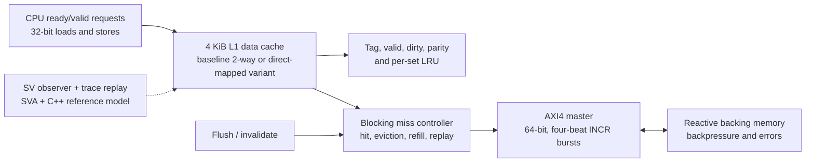
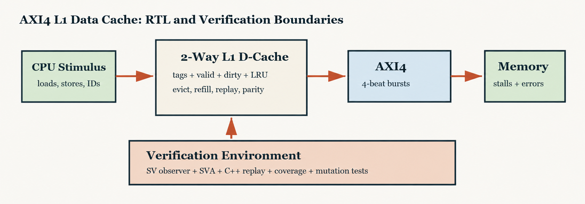

# AXI4 L1 Data Cache DV Project

A standalone RTL and design-verification project focused on cache microarchitecture, independent C++ prediction, replacement/error containment, and architecture tradeoffs. The blocking 4 KiB baseline is 2-way set-associative; equal-capacity direct-mapped and optional SECDED variants provide measured associativity and RAS evidence. Separate optional lanes demonstrate a two-MSHR non-blocking cache, SRAM March C-minus BIST, and a GCC-programmed dual-RV32 MSI/RVWMO crossover without changing the closed baseline cache interface.

This repository is independent of the earlier chiplet project. It reuses workflow ideas, but contains new cache RTL, tests, assertions, reference modeling, and reports.

## Verification Snapshot

This table is generated from canonical CSV reports by `make readme-metrics`.

<!-- BEGIN GENERATED METRICS -->
| Evidence | Current result |
| --- | ---: |
| Directed scenarios | `22 / 22` |
| Seeded stress | `100 / 100` |
| C++ trace replay | `127 / 127` |
| Functional coverage | `21 / 21` |
| Interaction coverage | `55 / 55` |
| Mutation detection | `4 / 4` |
| SECDED RAS coverage | `7 / 7` |
| Optional MSI coherence | `16 / 16` |
| C++-modeled MSI random seeds | `25 / 25` |
| MSI mutation detection | `3 / 3` |
| SRAM BIST | `7 / 7` |
| Integrated cache-array BIST | `2 / 2` |
| Optional non-blocking cache | `11 / 11` |
| Non-blocking targeted coverage | `12 / 12` |
| Two-MSHR request-window speedup | `2.080x` |
| Raw baseline line coverage | `49 / 71 (69.01%)` |
| Reviewed baseline line coverage | `27 / 28 (96.43%); 43 excluded` |
| 2-way baseline + edge line coverage | `raw 54 / 71 (76.06%); reviewed 32 / 32 (100.00%); 39 excluded` |
| Raw branch / toggle coverage | `76.19% / 57.45%` |
| Dual-RV32 GCC matrix | `24 / 24` |
| Executable RTL RVWMO litmus schedules | `400 / 400` |
| Pinned herd7 litmus oracle | `16 / 16` |
| Coherent seeded workloads | `50 / 50` |
| Coherent functional / cross coverage | `64 / 64 / 48 / 48` |
| Focused crossover closure | `34 / 34` |
| Transaction-correlated advanced crosses | `48 / 48` |
| Coherent assertion activation | `20 / 20` |
| Coherent RTL mutations | `17 / 17` |
| Coherent formal proof/cover groups | `10 / 10` |
| Coherent error/reset scenarios | `9 / 9` |
| Coherent QoS/concurrency scenarios | `6 / 6` |
| Coherent measured RTL performance | `80 / 80` |
| Coherent raw line / branch coverage | `95.28% / 92.86%` |
| Coherent named integration assertions | `18` |
<!-- END GENERATED METRICS -->

The executable suite covers cold refill, warm hits, clean and dirty replacement, independent AXI channel waits, read/write error propagation, byte strobes, maintenance, reset recovery, and seeded-random data checking. Generated metrics are in [docs/project_metrics.md](docs/project_metrics.md). Claims remain separate from targets that have not closed.

### Crossover Evidence Boundary

| Category | Evidence source | Claim boundary |
| --- | --- | --- |
| Executable coherent RTL | GCC firmware, 400 litmus schedules, 34 focused integration cases, errors/reset, QoS, measured performance | Canonical crossover evidence |
| Independent references | Per-hart ISS, event-driven MSI/final-state model, exact `herd7` allowed sets | Architectural, coherence, and final-memory checking |
| Formal | Seven implementation-bound and three reduced-model proof/cover groups | Depth-stated, not exhaustive closure |
| Operational model | Random exploration and explanatory secondary results | Never used to close canonical RTL bins |

## Architecture


```mermaid
flowchart LR
    CPU["CPU ready/valid requests\n32-bit loads and stores"] --> CACHE["4 KiB L1 data cache\nbaseline 2-way or direct-mapped variant"]
    CACHE --> TAG["Tag, valid, dirty, parity\nand per-set LRU"]
    CACHE --> CTRL["Blocking miss controller\nhit, eviction, refill, replay"]
    CTRL --> AXI["AXI4 master\n64-bit, four-beat INCR bursts"]
    AXI <--> MEM["Reactive backing memory\nbackpressure and errors"]
    MAINT["Flush / invalidate"] --> CTRL
    MON["SV observer + trace replay\nSVA + C++ reference model"] -.-> CACHE
```



## Cache Policy

| Property | Configuration |
| --- | --- |
| Capacity | 4 KiB |
| Baseline associativity | 2-way |
| Line size | 32 bytes |
| Baseline sets | 64 |
| CPU data width | 32 bits |
| AXI data width | 64 bits |
| Write policy | Write-back, write-allocate |
| Replacement | One LRU victim bit per set |
| Outstanding misses | One |
| Integrity | Per-word parity |

The comparison variant uses `128 sets x 1 way`; the baseline uses `64 sets x 2 ways`. Both retain 4 KiB capacity and 32-byte lines, so the study isolates associativity and set-count effects.

The AXI interface is deliberately constrained to one outstanding transaction, fixed ID semantics, and four-beat `INCR` bursts. This is not an AXI compliance claim.

## Quick Start

```bash
make smoke          # fast cold-miss/hit/store path
make project-check  # lint, C++ model, regression, coverage/report generation
make release-check  # stress, trace replay, crosses, performance, mutations, code coverage
make model-trace-check
make ras-check       # optional SECDED correction/containment matrix
make coherence-check # optional two-node MSI sharing/invalidation/intervention checks
make bist-check      # optional SRAM March C-minus BIST and fault diagnostics
make integration-synth-check # Yosys proxies for coherence and BIST blocks
make nonblocking-cache-check # two-MSHR concurrency, merging, OOO refill, and speedup study
make coherent-rv32-smoke # two GCC-built RV32 harts, store buffers, FENCE, and MSI
make coherent-rtl-litmus-check # 400 executable schedules checked against exact herd7 sets
make coherent-error-reset-check # precise loads, deferred stores, and reset epochs
make coherent-qos-concurrency-check # bank overlap, serialization, priority, and aging
make coherent-crossover-check # 34 store-buffer/coherence/error/reset/QoS cases
make coherent-advanced-coverage # 48 transaction-correlated integration crosses
make coherent-assertion-coverage # named assertion/invariant antecedent activation
make coherent-code-coverage # integration RTL line/branch/toggle coverage
make coherent-release-check # full GCC, litmus, error/reset, formal, mutation, coverage, performance gate
make cache-cross-coverage
make coverage-edges # optional byte-strobe, reset/error, LRU, maintenance, and direct-mapped coverage evidence
make performance-sweep
make associativity-check
make associativity-characterize
make synth-characterize # Yosys associativity-cost proxy when Yosys is installed
make bug-validate   # expected-failure mutation checks
make debug-waveform # FST plus deterministic assertion-debug SVG
make formal-prove   # bounded safety, reachability, and mutation checks
make formal-small-prove # reduced-geometry bounded proof/cover lane when sby is installed
```

The default flow uses the system Verilator and the C++ trace checker. Optional UVM source is retained only as secondary methodology collateral in [the UVM status page](docs/uvm_status.md); it is not part of the reviewer quick path or closure claim.

## Reviewer Path

For a focused design-verification review:

1. Start with [project metrics](docs/project_metrics.md) for report-backed results.
2. Use the [verification traceability matrix](docs/traceability.md) to map requirements to stimulus, checkers, assertions, and coverage.
3. Read the [cache architecture](docs/architecture.md) for hit, eviction, refill, writeback, and maintenance behavior.
4. Review the [bug diary](docs/bug_diary.md) for four implemented mutation/debug cases.
5. Follow the [hiring-manager case study](docs/hiring_manager_case_study.md) for assertion-driven early-`WLAST` failure triage and waveform evidence.
6. Inspect [functional and code coverage](docs/coverage.md), [structural-variant coverage](docs/structural_variant_coverage.md), [true cross coverage](docs/cross_coverage.md), and [per-request performance characterization](docs/performance.md).
7. Review the [AXI4 subset compliance appendix](docs/axi_subset_compliance.md), [equal-capacity associativity study](docs/associativity_characterization.md), and [synthesis characterization](docs/synthesis_characterization.md).
8. Check [SECDED/RAS evidence](docs/ras.md), [coverage closure case study](docs/coverage_closure_case_study.md), and [formal evidence](docs/formal.md).
9. Review the separately scoped [coherence and SRAM-BIST extension](docs/coherence_and_bist.md).
10. Inspect the [non-blocking cache study](docs/nonblocking_cache.md) for hit-under-miss, merged misses, out-of-order refills, and measured request-window speedup.
11. Explore the [dual-RV32 coherent memory-system crossover](docs/coherent_memory_system.md) and its [interactive evidence explorer](docs/coherent_evidence_explorer.html) for GCC, MSI, RVWMO, formal, and mutation evidence.

## Verification Bar

| Evidence | Implementation |
| --- | --- |
| Directed access matrix | Named read hit/miss, write hit/miss, clean/dirty eviction, and reset-recovery tests |
| AXI and memory checking | Reactive four-beat AXI model plus independent C++ trace replay and final-memory comparison |
| Assertions | Named CPU, AXI, replacement, maintenance, error-containment, and reset properties |
| Random and coverage | 100 reproducible manifest scenarios, feature coverage, and same-window interaction crosses |
| Coverage edges | Optional byte-strobe, reset beat matrix, AXI error matrix, LRU/replacement, maintenance-boundary, and direct-mapped structural coverage lane |
| Debug and automation | Four mutation detections, FST/SVG case study, GitHub Actions, and `make release-check` |
| Architecture tradeoff | 20 directed full-RTL geometry checks, 14 model-checked characterization points, and a Yosys associativity-cost proxy |
| Reliability variant | Optional data SECDED with correction, read scrub, double-error containment, C++ known-answer checks, assertions, and a 7-point RAS matrix |
| Integration and DFT extensions | Optional two-node MSI coherence checks plus synthesizable March C-minus SRAM BIST with stuck-at fault diagnostics |
| Concurrency extension | Optional two-MSHR cache with hit-under-miss, same-line merging, ID-routed refills, dirty writeback buffering, and separate performance evidence |
| Firmware/coherence crossover | Two GCC-built RV32 harts, private store buffers, MSI ownership, RVWMO litmus outcomes, seeded shared-memory workloads, and solver-backed leaf checks |
| Formal | Depth-stated safety/error checks, reachable covers, and expected mutation failures |
| AXI subset | Cache-master subset contract mapped to assertions, tests, and reports |

## Verification Structure

- Directed and manifest-driven SystemVerilog stimulus with every random knob applied through plusargs.
- Bound event observer and independent C++ trace replay for responses, replacement, AXI bursts, errors, resets, maintenance, and backing memory.
- Named protocol and architecture assertions for fault containment, ordering, replacement, and maintenance exclusion.
- Non-gating UVM CPU agent, memory component, monitor, scoreboard, and sequence source retained as optional collateral.
- SymbiYosys bounded safety/error checks with hit, miss, dirty-eviction, and maintenance witness traces.
- Generated regression, functional-coverage, mutation, performance, and metrics artifacts.

The [verification plan](docs/verification_plan.md) defines the intended closure model. The [bug diary](docs/bug_diary.md) records only implemented mutations, and [UVM status](docs/uvm_status.md) separates compilation evidence from incomplete runtime validation.

## Scope Boundaries

The baseline 4 KiB cache intentionally excludes coherence, atomics, MSHRs, non-blocking misses, speculative requests, and production-qualified ECC/RAS. The optional non-blocking cache is a separate bounded two-MSHR microarchitecture study and does not inherit the baseline maintenance, SECDED, or closure claims. The dual-RV32 crossover is an educational MSI/RVWMO integration lane, not ACE/CHI compliance or a production multicore. The standalone BIST wrapper demonstrates a March algorithm and fault diagnostics but is not foundry SRAM qualification. The AXI4 interface is a constrained cache-master subset, not an AXI compliance implementation. Open-source simulation, coverage, and formal collateral are verification evidence, not commercial protocol, DFT, timing, CDC, or silicon signoff.
