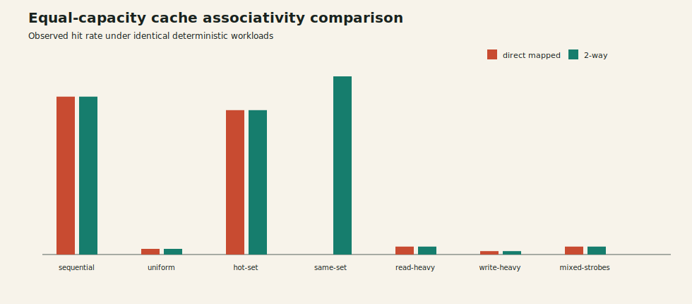

# Cache Associativity Characterization

Both variants are 4 KiB write-back, write-allocate caches with 32-byte lines. Results are deterministic behavioral Verilator measurements, not silicon timing or implementation signoff.

| Workload | Geometry | Hit rate | Clean evictions | Dirty evictions | p95 latency | Throughput | Yosys cells |
| --- | --- | ---: | ---: | ---: | ---: | ---: | ---: |
| `sequential` | `direct_mapped` | 85.89% | 0 | 1 | 16 | 0.11088 | 8 |
| `uniform` | `direct_mapped` | 3.07% | 32 | 37 | 23 | 0.04483 | 8 |
| `hot_set` | `direct_mapped` | 78.53% | 0 | 1 | 15 | 0.09583 | 8 |
| `same_set` | `direct_mapped` | 0.00% | 82 | 78 | 23 | 0.04405 | 8 |
| `read_heavy` | `direct_mapped` | 4.29% | 53 | 19 | 23 | 0.04837 | 8 |
| `write_heavy` | `direct_mapped` | 1.84% | 16 | 67 | 23 | 0.04066 | 8 |
| `mixed_strobes` | `direct_mapped` | 4.29% | 32 | 44 | 23 | 0.04414 | 8 |
| `sequential` | `two_way` | 85.89% | 1 | 0 | 16 | 0.11088 | 26 |
| `uniform` | `two_way` | 3.07% | 31 | 29 | 23 | 0.04474 | 26 |
| `hot_set` | `two_way` | 78.53% | 1 | 0 | 15 | 0.09583 | 26 |
| `same_set` | `two_way` | 96.93% | 1 | 1 | 2 | 0.14658 | 26 |
| `read_heavy` | `two_way` | 4.29% | 43 | 18 | 23 | 0.04820 | 26 |
| `write_heavy` | `two_way` | 1.84% | 18 | 55 | 23 | 0.04029 | 26 |
| `mixed_strobes` | `two_way` | 4.29% | 29 | 37 | 23 | 0.04391 | 26 |

## Implementation Proxy

| Geometry | Yosys status | Cell-count proxy | Area proxy | Timing proxy |
| --- | --- | ---: | ---: | ---: |
| `direct_mapped` | PASS | 8 | 564 | NA |
| `two_way` | PASS | 26 | 585 | NA |

## Interpretation

- The configurations hold capacity and line size constant, isolating associativity and set-count effects.
- Same-set traffic exposes conflict behavior; the 2-way cache can retain two lines per set while direct-mapped placement cannot.
- Refill/writeback traffic and latency are derived from normalized observer traces and checked by the independent C++ model.
- Yosys/OpenSTA numbers are implementation proxies only. `SKIP`/`NA` means the required open-source tool was unavailable in the local environment; no synthesis-cost claim is inferred from simulation.

