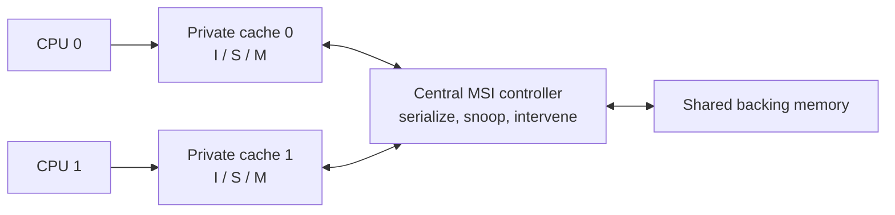

# Coherence and SRAM-BIST Extension

These are optional, separately reported design demonstrations. They do not change the interface, architecture, or `21 / 21` closure claim of the baseline 4 KiB L1 cache.

## Two-Cache MSI Demonstration

`msi_two_cache_subsystem` implements two small private direct-mapped caches, shared backing memory, and a centralized one-request-at-a-time coherence controller. Each resident line is `Invalid`, `Shared`, or `Modified`.



The directed lane checks read sharing, shared-to-modified upgrades, peer invalidation, modified-owner intervention, dirty conflict writeback, post-invalidation reads, and simultaneous-request serialization. A second lane runs 25 deterministic 120-operation workloads. An independent C++ model maintains its own private-cache states and uses them to predict every returned value plus intervention, invalidation, dirty-writeback, and final event counters. Three RTL mutations prove sensitivity to missed invalidation, missed downgrade, and missing dirty intervention. Named assertions prevent two modified owners for the same line and simultaneous request acceptance.

This is not ACE/CHI, MESI, a distributed snoop fabric, or a scalable directory implementation. Its purpose is to show coherent-state reasoning and checker construction in a bounded, reviewable subsystem.

## March C-Minus SRAM BIST

`cache_sram_bist` wraps a parameterized SRAM with functional access, a BIST-owned test port, first-failure metadata, and simulation-controllable stuck-at injection. Its March C-minus sequence is:

1. Ascending write zero.
2. Ascending read zero/write one.
3. Ascending read one/write zero.
4. Descending read zero/write one.
5. Descending read one/write zero.
6. Descending read zero.

The standalone lane checks a clean array, stuck-at-zero and stuck-at-one faults at boundary/middle addresses, functional access outside BIST, exclusive port ownership while BIST is active, and reset clearing status.

Maintenance opcode `3` separately runs a bounded destructive test directly over the baseline cache's real data and parity/ECC arrays: integrity precheck, ascending write-zero, read-zero/write-one, read-one/write-zero, and final read-zero. It records first-failure metadata, invalidates every tested line, repeats cleanly, and verifies normal refill/reuse afterward in both parity and SECDED variants. This integrated controller is deliberately described separately from the standalone full March C-minus wrapper.

## Reproduction

```bash
make coherence-check
make bist-check
make integration-synth-check
```

Canonical results are in `reports/coherence_summary.csv`, `reports/msi_random_summary.csv`, `reports/msi_mutation_summary.csv`, `reports/bist_summary.csv`, `reports/cache_array_bist_summary.csv`, and `reports/integration_synthesis.csv`. Yosys numbers are implementation proxies, not scan insertion, ATPG, fault grading, or foundry memory qualification.
