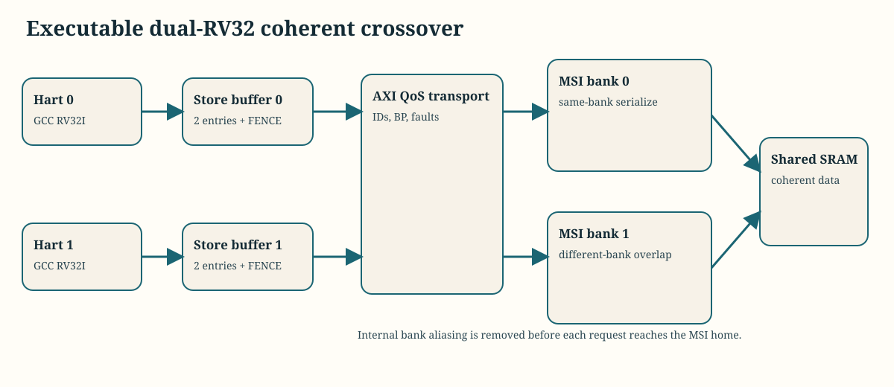
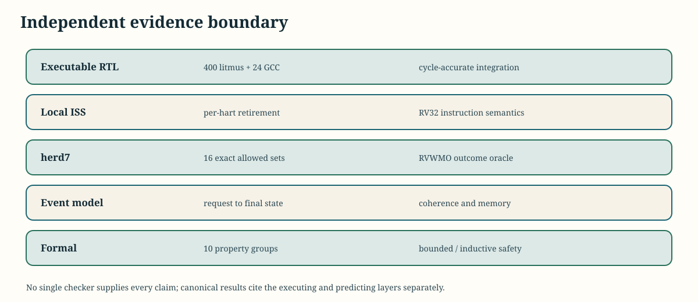
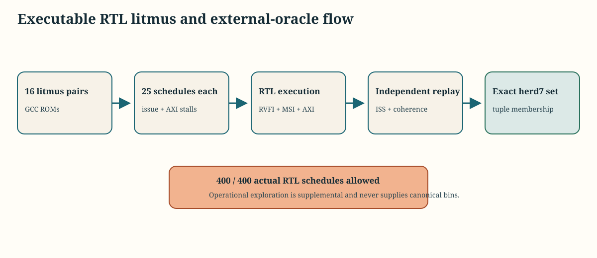
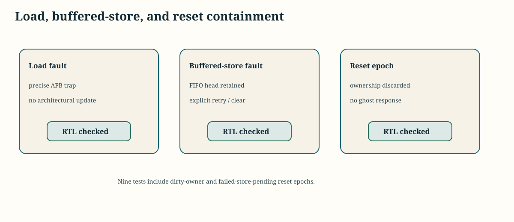
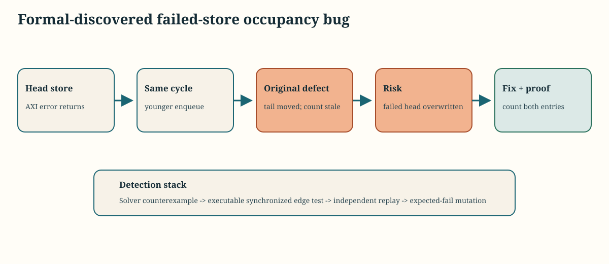
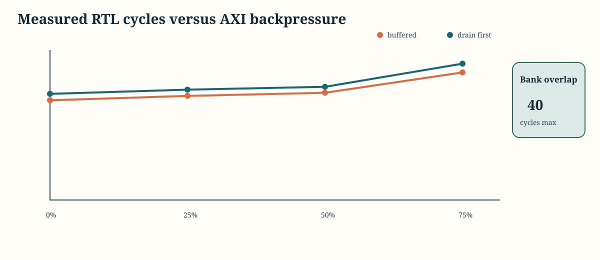

# Dual-RV32 Coherent Memory-System Crossover

This optional lane executes two GCC-built RV32I harts with private two-entry store buffers, a two-bank educational MSI home, and an AXI4 QoS transport. It demonstrates the distinction between cache coherence and RVWMO consistency without changing the closed single-cache baseline.

## Evidence Boundary

| Evidence | What actually runs | Release role |
| --- | --- | --- |
| RTL + ISS | Two RV32 cores, APB/store buffers, AXI transport, two MSI banks | `24 / 24` GCC executions |
| RTL + `herd7` | 16 litmus pairs, 25 schedules each, exact allowed-set membership | `400 / 400` canonical litmus executions |
| RTL event replay | Ownership, data, invalidation, intervention, response, and final memory | Required for every canonical RTL trace |
| Solver | Reduced implemented MSI/store-buffer RTL plus labeled architectural models | `10 / 10` depth-stated proof/cover groups |
| RTL mutations | Protocol, ownership, forwarding, fence, bank-route, reset, and failed-store defects | `17 / 17` detected |
| Operational model | Broad schedule exploration and explanatory performance | Supplemental only; never supplies canonical coverage |

## Executable Results

| Evidence | Result |
| --- | ---: |
| GCC workload/optimizer matrix with ISS replay | 24 / 24 |
| RTL litmus schedules accepted by exact `herd7` sets | 400 / 400 |
| Operational random workloads | 50 / 50 |
| Focused executable crossover closure | 34 / 34 |
| Error/reset scenarios | 9 / 9 |
| QoS/concurrency scenarios | 6 / 6 |
| Functional / same-window cross coverage | 64 / 64; 48 / 48 |
| Transaction-correlated advanced crosses | 48 / 48 |
| Assertion/invariant activation | 20 / 20 |
| RTL expected-fail mutations | 17 / 17 |
| Solver proof/cover groups | 10 / 10 |
| Coherent RTL raw line / branch coverage | 95.28%; 92.86% |

Each canonical coverage bin cites an executable RTL trace or formal cover. The explorer exposes actual hart, store-buffer, bank, MSI, AXI, and oracle events; operational-model results are reported as a separate evidence category.

## Coherence and Consistency

MSI prevents conflicting modified ownership and ensures modified intervention data is supplied before another hart receives ownership. That does not impose sequential consistency across different addresses. An unfenced load may bypass an older buffered store to another address, while `FENCE` drains prior shared stores before retirement.

The executable edge lane found and fixed an integration bug here: GCC emits `fence rw,rw` with predecessor/successor masks, while the first feeder implementation recognized only the zero-mask encoding. Fence detection now decodes opcode and `funct3`, and both harts demonstrate a real fence stall with occupied buffers.

## Errors, Reset, and Concurrency

Read errors return a precise APB fault and do not update architectural or cache state. Buffered-store errors are deliberately deferred: the FIFO head is retained, later drains stop, firmware reads the failing address, then explicitly clears and retries it. A separate executable case proves the unaffected bank continues while the failed bank is blocked. Reset advances a global epoch, discards outstanding ownership and buffered work, and invalidates dirty private state so pre-reset requests cannot create post-reset responses. Unflushed dirty data is deliberately not promised persistent across reset.

### Formal-Discovered Integration Bug

The new failed-head proof found a real simultaneous-event defect: if an older store failed in the same cycle that a younger store entered the FIFO, the tail advanced but occupancy did not. A later enqueue could overwrite the retained failing head. The fix counts the younger entry whenever the drain fails, and the repository now contains an executable synchronized regression, independent event replay, a depth-20 solver check, and an expected-fail mutation that restores the defect.

Two independent AXI target adapters allow requests to different MSI banks to overlap while same-bank conflicts serialize. Direct transport tests distinguish integrated concurrency from QoS leaf evidence: equal-QoS fairness, mixed-QoS priority, and starvation aging are checked without implying that a hart with only one active request can independently saturate every policy state.

## Performance

`reports/coherent_performance.csv` contains 80 measured RTL rows comparing buffered and conservative drain-before-next-operation execution at `0/25/50/75%` deterministic AXI backpressure. It reports cycles, retirements, CPI, load and store-drain latency, AXI waits, simultaneous-bank utilization, coherence events, per-hart grants, and accepted throughput. These are behavioral Verilator cycles, not frequency, power, or silicon performance.

## Scope

- Shared accesses are aligned RV32I words; RV32A, LR/SC, mixed-size concurrent accesses, virtual memory, and Linux are out of scope.
- This educational MSI/RVWMO subsystem is not ACE/CHI or AXI coherence compliance.
- Formal results are depth-stated safety checks with reachable covers, not exhaustive multicore proof.
- The focused coherent lint lane suppresses Verilator `UNOPTFLAT` for the reviewed vendored fabric arbitration/ready path; other warnings remain fatal.
- `herd7` validates observed outcome membership; passing does not mean simulation observed every architecturally allowed outcome.
