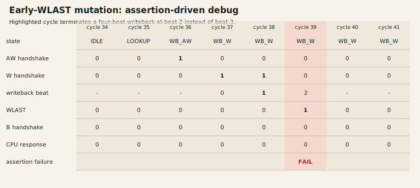

# Debug Case Study: Early AXI WLAST

## Scenario

`CACHE_BUG_WLAST_EARLY` changes writeback termination from beat three to beat two. The `dirty_evict` scenario creates a modified victim and then accesses a third line in the same set, forcing a four-beat AXI writeback before refill.

## Failure And Detection

The mutation asserts `WLAST` on beat two. The bound property `a_wlast_exactly_final_beat` fails immediately, before the incomplete burst can be accepted as a valid cache-line writeback. The reactive AXI memory and final backing-memory comparison provide independent downstream detection.

The release flow also generates `build/debug_wlast/wlast_early.fst` for signal-level inspection. The checked-in SVG combines the normalized observer trace with the named assertion result; the failing beat is rejected before it handshakes. This keeps the artifact reproducible in headless CI without implying that an illegal transfer was accepted.

## Root Cause And Resolution

The injected condition compared the writeback beat against `2` rather than the architectural final beat `3`. The nominal RTL uses `wb_beat == 2'd3`; the mutation remains compile-time isolated and is required to fail in `make bug-validate` and `make debug-waveform`.

## Regression Evidence

- Nominal dirty eviction completes all four beats and passes the C++ trace checker.
- The mutation is classified as an expected detection, not a passing design test.
- The assertion, AXI memory behavior, and final-memory scoreboard protect the same failure through independent mechanisms.
