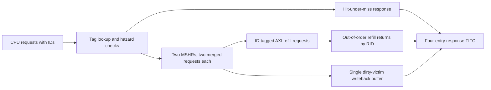

# Non-Blocking Cache Study

This optional RTL variant isolates the architectural value and verification risks of limited memory-level parallelism. It does not replace or inflate the closed blocking-cache baseline.

## Implemented Behavior

- Two independent misses may remain outstanding when they target different sets.
- A hit may complete while another line is waiting for refill.
- Two requests to the same missing line merge into one AXI read transaction.
- AXI read responses are routed by ID, so distinct refills may complete out of request order.
- Dirty victim data is copied into a writeback buffer before refill. A failed writeback restores the victim and returns an error instead of silently discarding dirty data.
- Reset cancels outstanding ownership and prevents post-reset ghost responses.

Seven named assertions protect final-beat placement, writeback-before-refill ordering, response capacity, active refill IDs, duplicate-line allocation, same-set hazards, and writeback ownership.

## Measured Evidence

The generated [scenario report](../reports/nonblocking_cache_report.md) records `11 / 11` passing directed, randomized, reset, error, and performance cases. The [coverage summary](../reports/nonblocking_cache_coverage.csv) records `12 / 12` targeted points.

The same 32-request workload took `778` cycles when software serialized each request and `374` cycles with a two-entry request window, a measured `2.08x` simulated-cycle speedup. Both measurements use the same RTL, backing-memory timing, and clock. This demonstrates latency overlap in the behavioral model; it is not a claim about post-synthesis frequency or silicon performance.

## Scope

This variant is intentionally bounded to two MSHRs, two merge slots per line, one dirty writeback buffer, and two ways. Same-set independent misses serialize. It does not currently include the baseline maintenance engine, SECDED option, coherence demo, or production cache features such as speculation, cancellation, or non-blocking stores.
